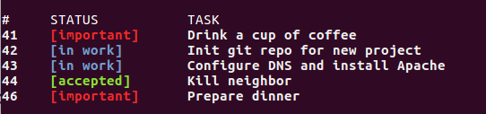

# Tasker v1.1

### How to use
**Linux**

     $ ./tasker [arguments]
     
### Arguments
	  -a      add task
	  -d      delete task by [id] (#)
	  --help  show this help message and exit
	  -s      show task list
	  -ud     update description of task by [id] (#)
	  -us     update status of task by [id] (#)

### Examples

##### Show tasks 

##### Add task

##### Update task description (use -us for update status)

##### Delete and show

